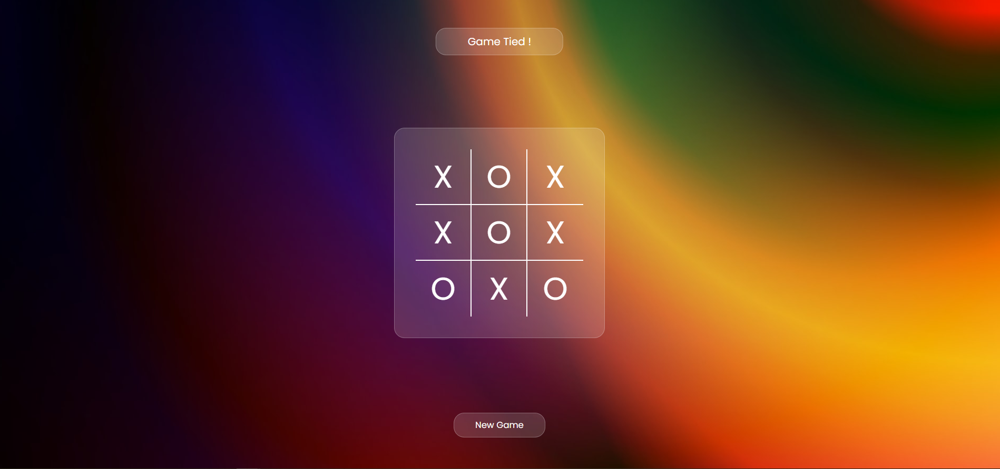

# Tic-Tac-Toe Game

A clean and interactive Tic-Tac-Toe game built using **HTML, CSS, and JavaScript**.  
This project focuses on DOM manipulation, game logic handling, turn switching, and winning condition checks.

## Preview

## Features

- Two-player gameplay (X vs O)
- Dynamic turn indicator
- Winner detection system
- Tie game detection
- Restart / New Game functionality
- Interactive UI with glassmorphism effect
- Responsive centered layout

## Tech Stack

- HTML5
- CSS3
- Vanilla JavaScript

## Game Logic

The game checks all possible winning combinations:

- Rows
- Columns
- Diagonals

After every move:
- Turn swaps automatically
- Winning positions are highlighted
- Board gets disabled after result

## Live Demo

[Live Preview](https://tic-tac-toe-six-gold-66.vercel.app/)

## Learning Outcomes

Through this project, I practiced:

- DOM Selection & Manipulation
- Event Handling
- Array-based Game State Management
- Conditional Logic
- Dynamic UI Updates
- JavaScript Functions & Loops

## Author

**Anshika**
